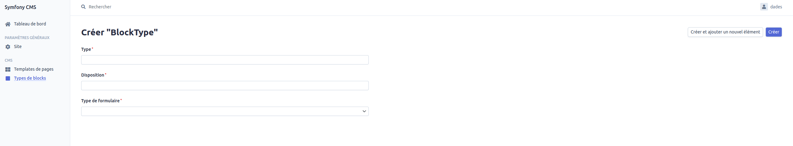
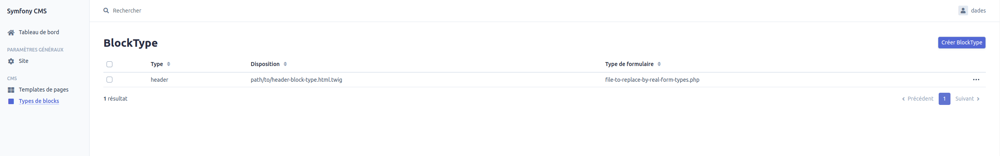
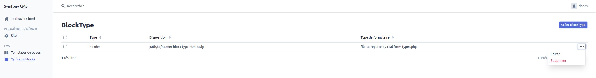
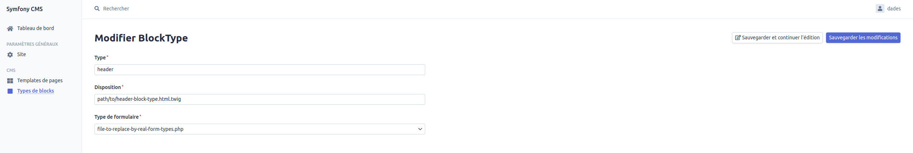
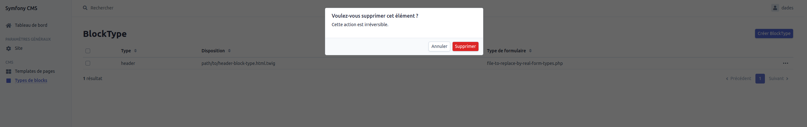

# Documentation fonctionnelle du Block Type Template (type de block)

Pour toutes les parties listées ci-dessous, vous devez être connecté au Back office (BO) avec les droits **SUPER_ADMIN**.

## Création

L'accès à la page de création d'un Block Type se fait en passant par la grille d'affichage des Blocks Types. (voir la [Grille](#grid)).
Il faut ensuite cliquer sur le bouton `Créer BlockType`.
Cette action va afficher le formulaire de création d'un Page Template (voir screenshot ci-dessous).  
Le type est le layout d'un Block Type sont obligatoires et sont uniques.  
Le type de formulaire est obligatoire.  

## Affichage

### Grille

L'affichage de la grille Block Type se fait en cliquant sur `Types de blocks` dans la section CMS du menu.

## Mise à jour

La modification d'un Block Type s'effectue en accédant à la grille des Blocks Types puis en cliquant sur `...` > Editer  (voir la [Grille](#grid)).

Il est possible de modifier le nom et le chemin vers le layout.  
Le layout d'un Block Type est un fichier au format .html.twig contenant la structure globale de la page.

## Suppression

La suppression d'un Block Type s'effectue en accédant à la grille des Blocks Types puis en cliquant sur `...` > Supprimer (voir la [Grille](#grid)).
Puis en cliquant sur supprimer dans la popup qui apparait.

