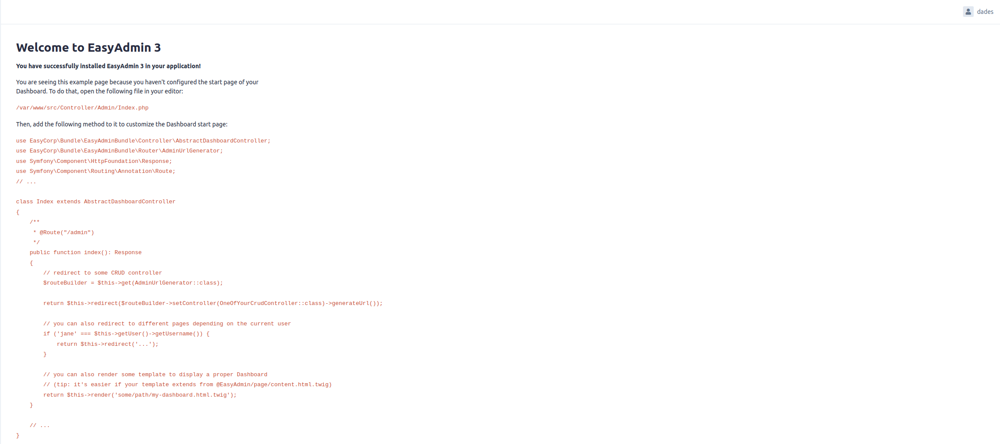

# Documentation technique du dashboard

Pour avoir accès aux différentes pages, il faut avoir le rôle ADMIN au minimum.

## Page d'accueil

Après une connexion réussie, vous accédez à la page d'accueil.  

## Menu

Le menu contient différentes entrées pour gérer le CMS.  

