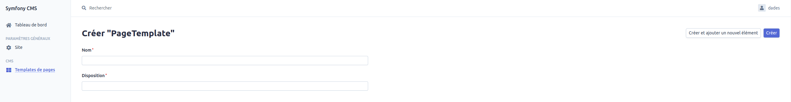
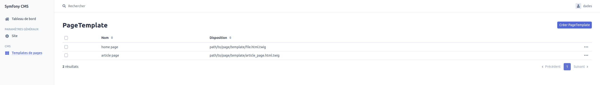
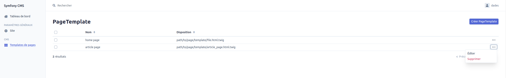
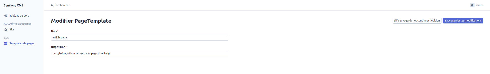
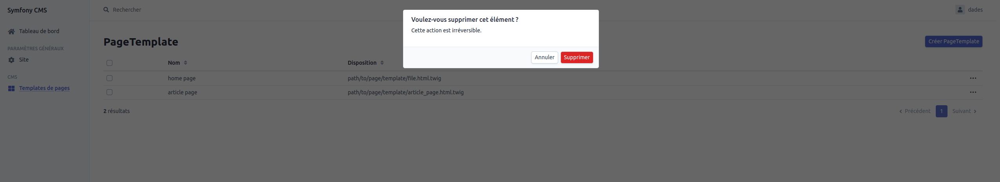

# Documentation fonctionnelle du Page Template (patron de page)

Pour toutes les parties listées ci-dessous, vous devez être connecté au Back office (BO) avec les droits **SUPER_ADMIN**.

## Création

L'accès à la page de création d'un Page Template se fait en passant par la grille d'affichage des Page Templates. (voir la [Grille](#grid)).
Il faut ensuite cliquer sur le bouton `Créer PageTemplate`.
Cette action va afficher le formulaire de création d'un Page Template (voir screenshot ci-dessous).  
Le nom est le layout d'un Page Template sont obligatoires et sont uniques.

## Affichage

### Grille

L'affichage de la grille Page Template se fait en cliquant sur `Templates de pages` dans la section CMS du menu.

## Mise à jour

La modification d'un Page Template s'effectue en accédant à la grille des Pages Templates puis en cliquant sur `...` > Editer  (voir la [Grille](#grid)).

Il est possible de modifier le nom et le chemin vers le layout.  
Le layout d'un Page Template est un fichier au format .html.twig contenant la structure globale de la page.

## Suppression

La suppression d'un Page Template s'effectue en accédant à la grille des Pages Templates puis en cliquant sur `...` > Supprimer (voir la [Grille](#grid)).
Puis en cliquant sur supprimer dans la popup qui apparait.

