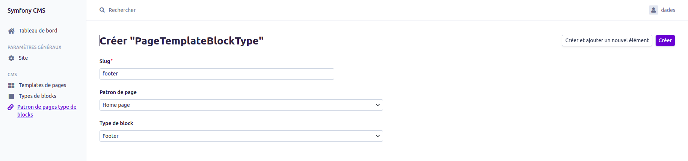
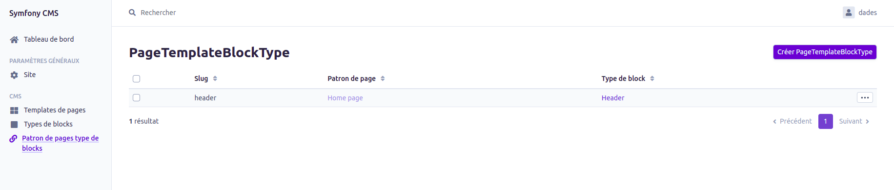
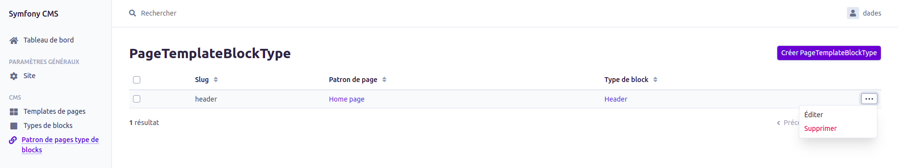
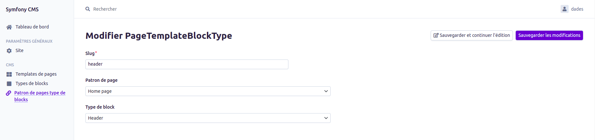
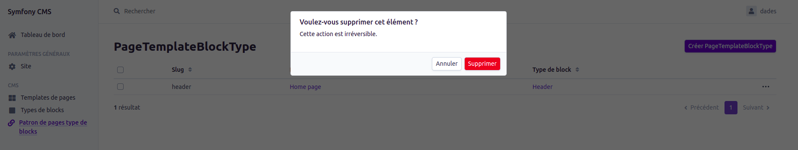

# Documentation fonctionnelle du Page Template (patron de page)

Pour toutes les parties listées ci-dessous, vous devez être connecté au Back office (BO) avec les droits **SUPER_ADMIN**.

## Création

L'accès à la page de création d'un Page Template Block Type se fait en passant par la grille d'affichage des Page Templates Block Type. (voir la [Grille](#grid)).
Il faut ensuite cliquer sur le bouton `Créer PageTemplateBlockType`.
Cette action va afficher le formulaire de création d'un Page Template Block Type (voir screenshot ci-dessous).  
Le slug, le Page Template et le Block Type d'un Page Template Block Type sont obligatoires et l'union des trois champs doit être unique.

## Affichage

### Grille

L'affichage de la grille Page Template Block Type se fait en cliquant sur `Patron de pages type de blocks` dans la section CMS du menu.

## Mise à jour

La modification d'un Page Template Block Type s'effectue en accédant à la grille des Pages Templates Block Type puis en cliquant sur `...` > Editer (voir la [Grille](#grid)).

Il est possible de modifier le slug, le Page Template et le Block Type.  
Il est à rappeler qu'il existe une contrainte d'unicité sur l'union de ces trois champs doit être unique.

## Suppression

La suppression d'un Page Template Block Type s'effectue en accédant à la grille des Pages Templates Block Type puis en cliquant sur `...` > Supprimer (voir la [Grille](#grid)).
Puis en cliquant sur supprimer dans la popup qui apparait.

