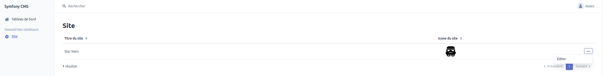
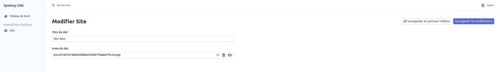

# Documentation fonctionnelle d'un Site

Pour toutes les parties listées ci-dessous, vous devez être connecté au Back office (BO).

## Création

**Un Site ne peut être créé que par un développeur**. Veuilez vous rapprocher de ce dernier pour effectuer la manipulation.

## Affichage

L'affichage du Site se fait en cliquant sur Site dans la section Paramètres Généraux.

## Mise à jour

La modification d'un Site s'effectue en accédant à la page d'affichage d'un Site puis en cliquant sur `...` > Editer  (voir l'[affichage d'un site](#display)).

Il est possible de modifier le titre et l'icône du site.  
Le titre du Site sera le nom affiché dans l'onglet du navigateur et dans le lien des moteurs de recherche.  
L'icône du Site correspond à la petite image présente dans l'onglet du navigateur. Celle-ci est facultative.

## Suppression

Un Site **ne peut pas et ne doit pas être supprimé**. Des conséquences désastreuses pourraient avoir lieu en terme de fonctionnement du site internet et du SEO.
